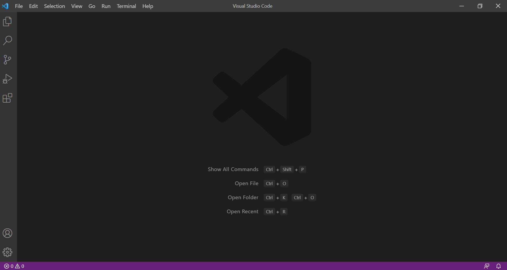
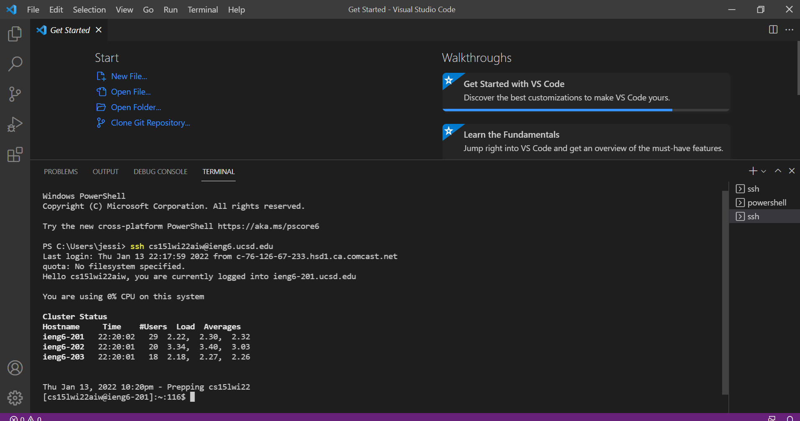
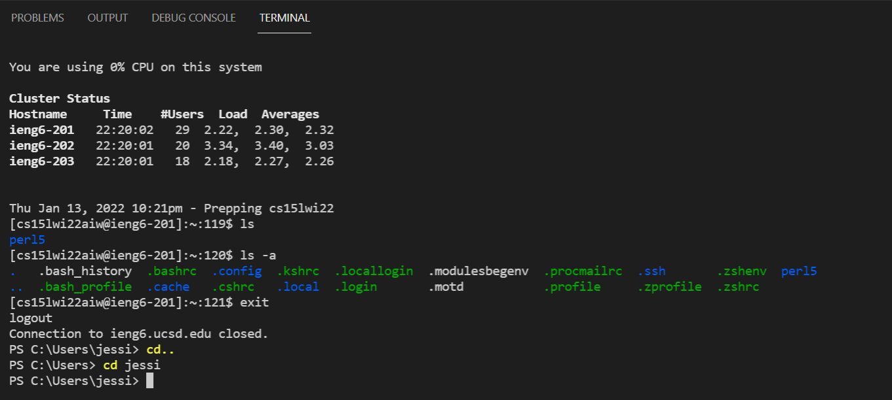
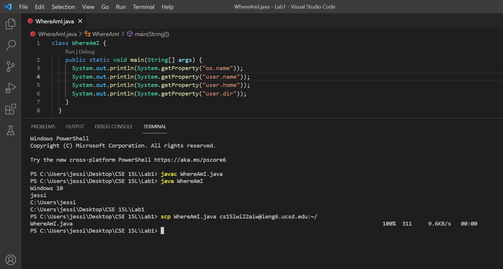
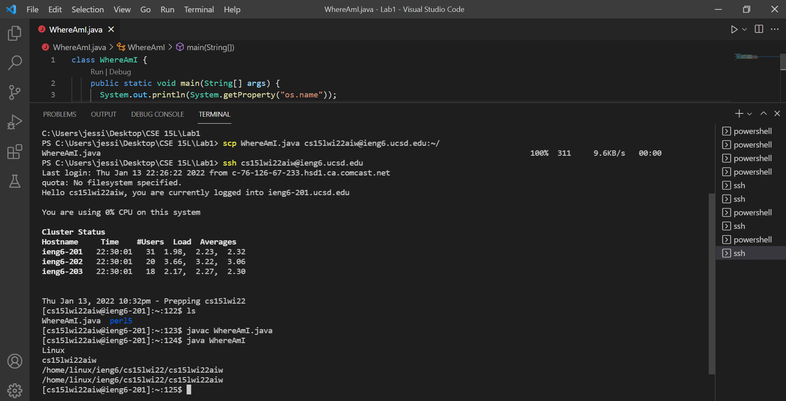
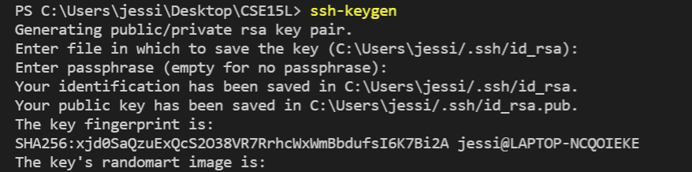
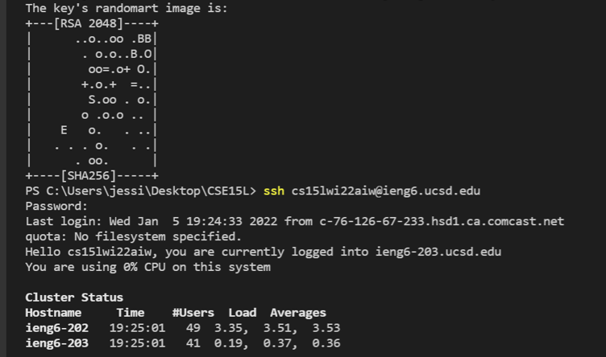
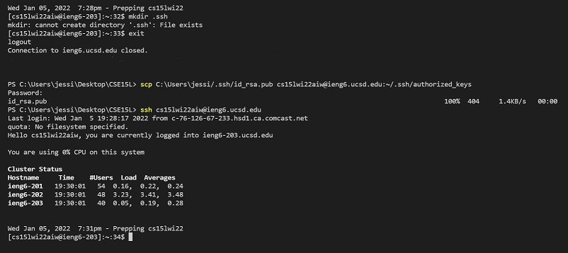
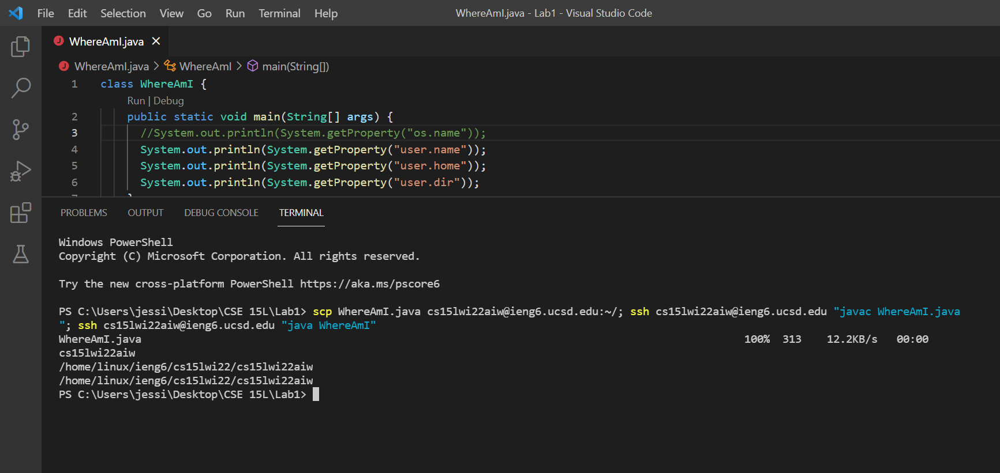

## Lab Report 1- Week 2
### Remote Access

**Step 1. Visual Studio Code**
* Install VScode: [https://code.visualstudio.com](https://code.visualstudio.com)
* Open a window as shown below

**Step 2. Remotely Connecting**
* Install OpenSSH: [InstallOpenSSH](https://docs.microsoft.com/en-us/windows-server/administration/openssh/openssh_install_firstuse)
* Look up your course specific account for CSE 15L on ieng6: [https://sdacs.ucsd.edu/~icc/index.php](https://sdacs.ucsd.edu/~icc/index.php)
* Open a terminal in VS code and *ssh* into your account
* If prompted, enter your password- it will not show up in your terminal.
* Here is a reference: [ConnectToARemoteHost](https://code.visualstudio.com/docs/remote/ssh#_connect-to-a-remote-host)

**Step 3. Trying Some Commands**
* *ls* lists all files in the current directory
* *ls -a* lists all files in the current directory, including hidden files
* *exit* logs you out of the remote server in your terminal
* *cd* changes directories

**Step 4. Moving Files over SSH with *scp***
* Create a new file on your computer and compile and run the program- use *javac* and *java*
* Use *scp* to copy the file to your ieng6 account
* Now *ssh* and run the program from ieng6

**Step 5. Setting an SSH Key**
* Use *ssh-keygen* to create two files on your system- a private key *id_rsa* and a public key *id_rsa.pub*
* Store the files in the *.ssh* directory on your computer (the client)
* Copy the public key to the *.ssh* directory on the server
* *ssh* from the client to the server- if the passphrase you entered was empty, you should no longer need to use your password

**Step 6. Optimizing Remote Running**
* To efficiently locally edit a file and copy it to the remote server, run multiple commands on the same line using a semicolon

