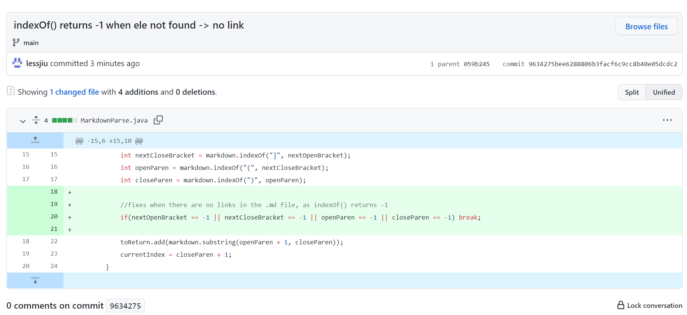
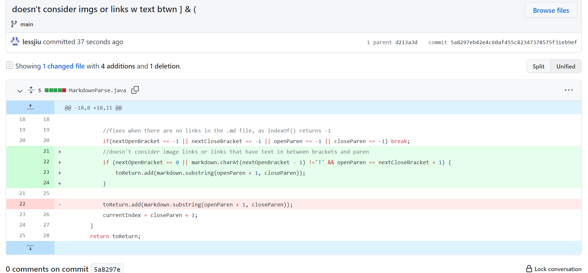
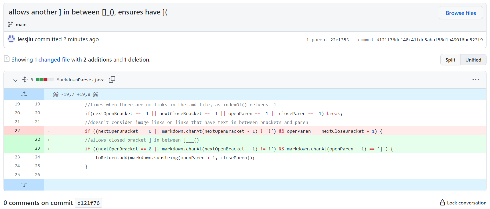

## Lab Report 2- Week 4
### Testing and Debugging

**Code Change 1**

- [Test file with failure-inducing input 1](https://github.com/lessjiu/markdown-parse/blob/main/case1.md)
- Symptom/Output: `[www.google.com]` 
- Expected Output: `[]` 

The failure inducing input was a file with a incorrectly formatted link 
that was missing a `]`. The symptom was that the output still included the 
incorrectly formatted link. This was caused by a bug in the original code, as 
it did not check whether or not the input had a `[`, `]`, `(` and `)`.

**Code Change 2**

- [Test file with failure-inducing input 2](https://github.com/lessjiu/markdown-parse/blob/main/case2.md)
- Symptom/Output: `[img.png, ucsd.edu]` 
- Expected: `[]` 

The failure inducing input was a file with an image linked and an incorrectly 
formatted link that had text between the `]` and `(`. The symptom was that the 
output still included the image link and the incorrectly formatted link. This was 
caused by a bug in the original code, as it did not check whether there was a 
`!` before the `(` which would mean it was actually an image link. Also, the code
didn't check whether the `]` and `(` were right next to each other. 

**Code Change 3**

- [Test file with failure-inducing input 3](https://github.com/lessjiu/markdown-parse/blob/main/case3.md)
- Symptom/Output: `[]` 
- Expected: `[www.canvas.com]`

The failure inducing input was a file with a correctly formatted link that had an 
extra `]` somewhere in between the `[` and `]`. The symptom was that the output did not
have a link. This was caused by a bug in the original code, as it did not account for 
checking if there were extra `]` in between the `[` and `]`.

