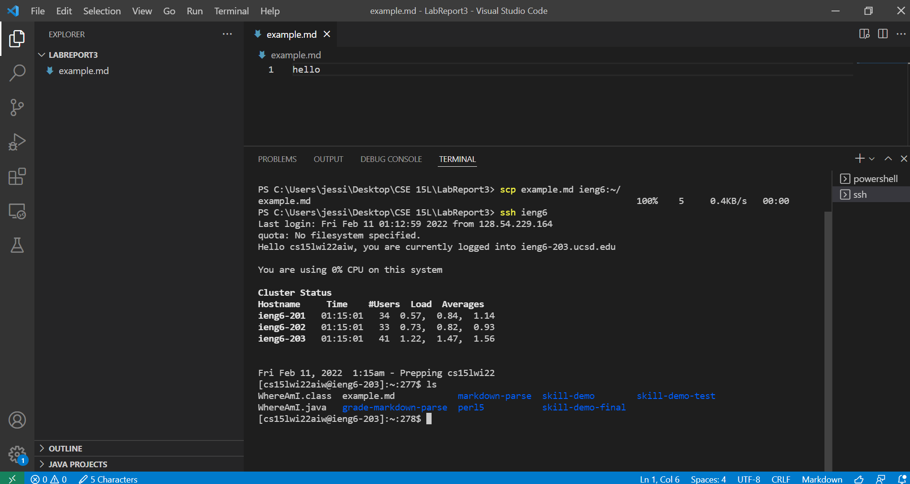

## Lab Report 3- Week 6
### Streamlining `ssh` Configuration

**Step 1**

- I opened the `.ssh/config` file on my computer and added the last three lines, as shown above. This tells SSH what username to use when logging into the server and nicknames the server as `ieng6`. This nickname is called an alias.

**Step 2**

- Because of the changes made in the `.ssh/config` file, I can now use the alias when I want use the `ssh` command to log into my ieng6 account. 

**Step 3**

- I can use the `scp` command to copy a file to my ieng6 account using just the alias. Here, I copied the file `example.md`. Then I used `ls` to check that the file was copied over. 