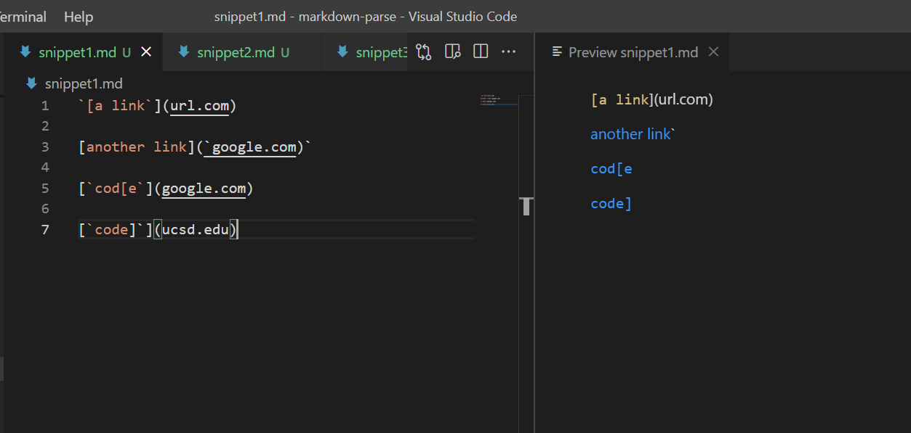
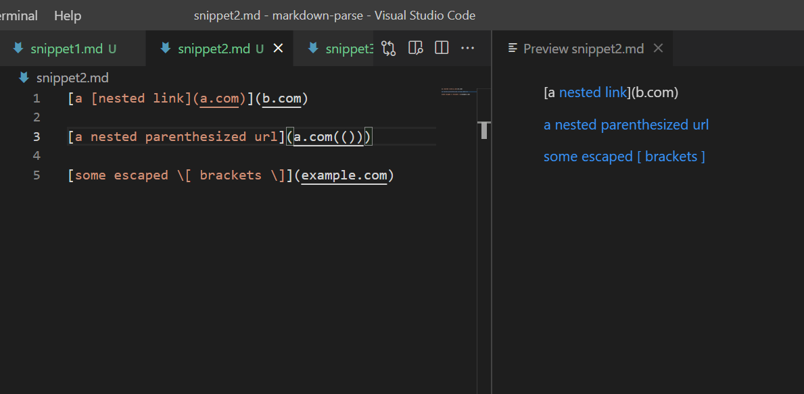
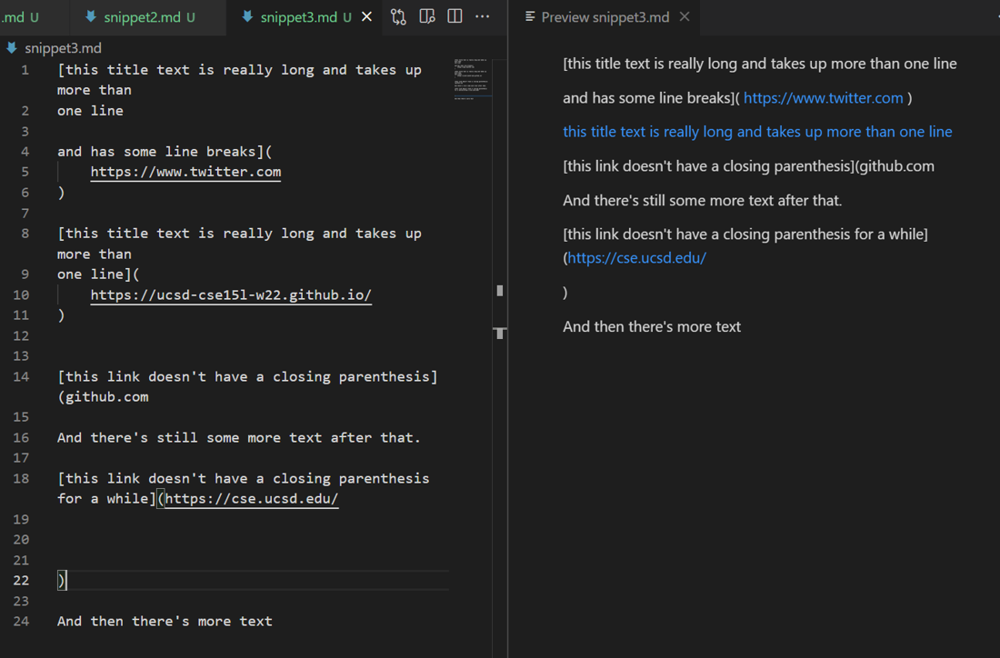
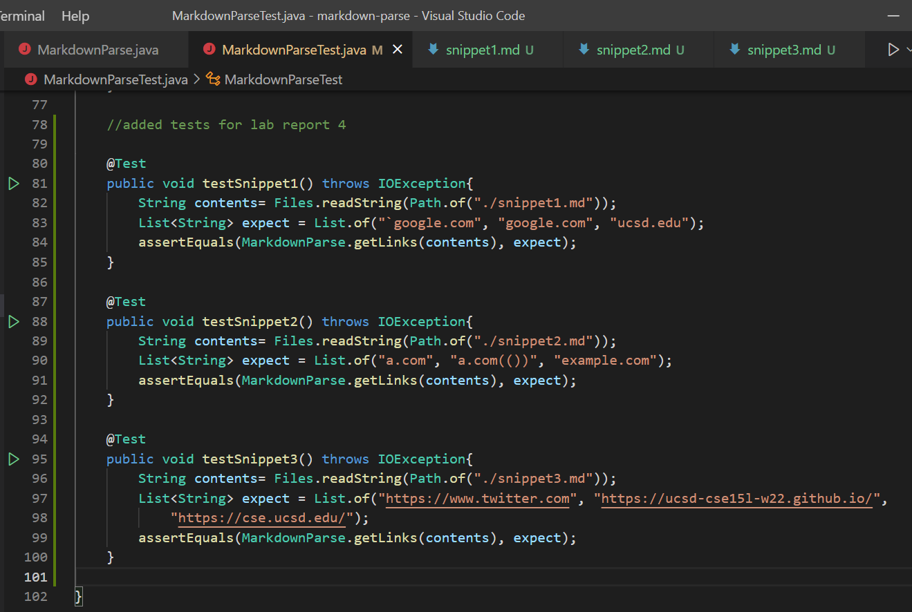
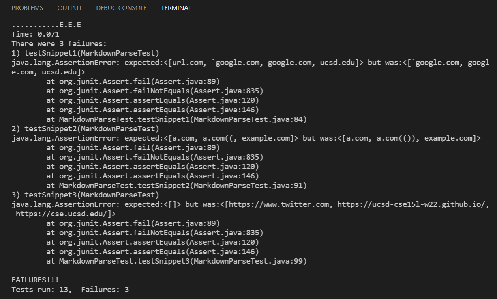
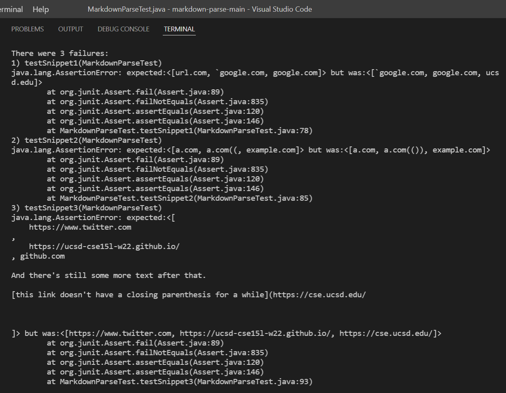

## Lab Report 4- Week 8
### More Tests

**Links to Repositories:**  
[MyMarkdownParseRepo](https://github.com/lessjiu/markdown-parse)  
[ReviewedMarkdownParseRepo](https://github.com/JessalynWang/markdown-parse)

**Previews**
- Snippet 1 should produce: ``[`google.com, google.com, ucsd.edu]``

- Snippet 2 should produce: `[a.com, a.com(()), example.com]`

- Snippet 3 should produce: `[https://www.twitter.com, https://ucsd-cse15l-w22.github.io/, https://cse.ucsd.edu/]`

**Tests**

**Outputs**
- My output: All 3 tests failed

- Review output: All 3 tests failed

**Questions**
1. Do you think there is a small (<10 lines) code change that will make your program work for snippet 1 and all related cases that use inline code with backticks? If yes, describe the code change. If not, describe why it would be a more involved change.    Yes, I could add another statement in the if statement before adding a link to our toReturn arraylist. Weshould check that there is no backtick before the open bracket before adding the link.

2. Do you think there is a small (<10 lines) code change that will make your program work for snippet 2 and all related cases that nest parentheses, brackets, and escaped brackets? If yes, describe the code change. If not, describe why it would be a more involved change.    No, there would have to be a more involved change because we would have to use a stack to keep track of the parentheses and brackets. This would need some if and else statements and would probably be more than 10 lines of code.

3. Do you think there is a small (<10 lines) code change that will make your program work for snippet 3 and all related cases that have newlines in brackets and parentheses? If yes, describe the code change. If not, describe why it would be a more involved change.     Yes, I think I could add a statement that checks for line breaks. If there are new lines, continue to where there is a character next and check what it is. 