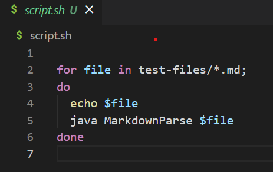
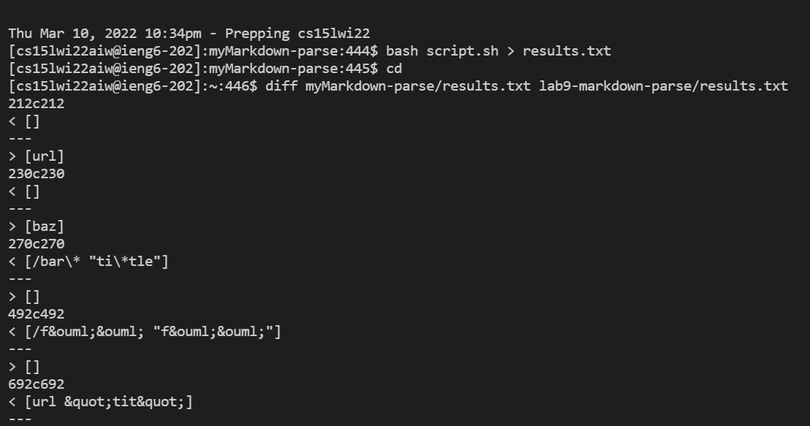
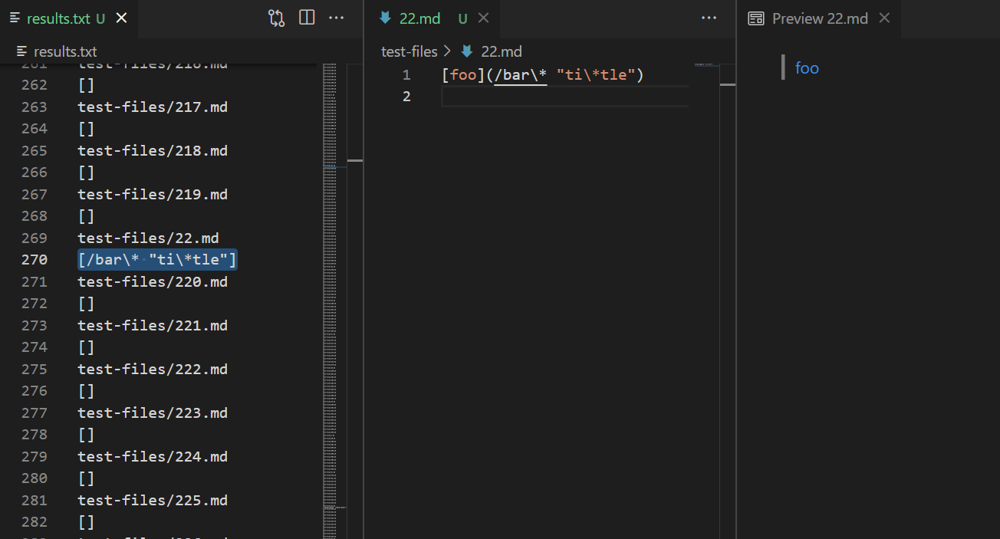
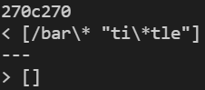
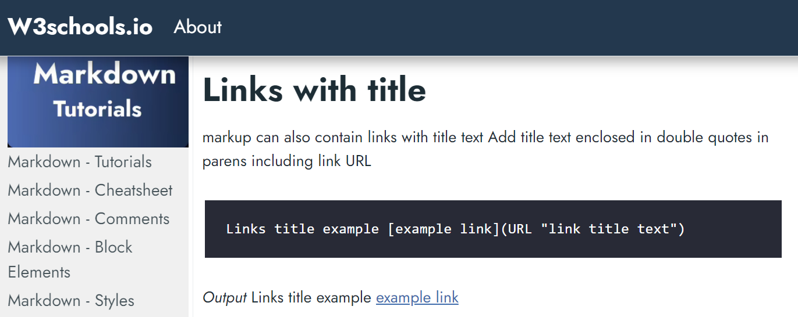
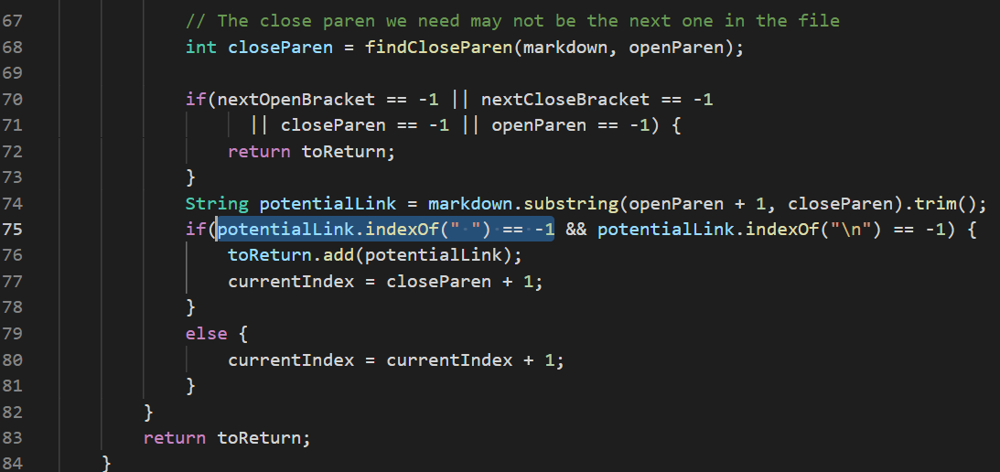
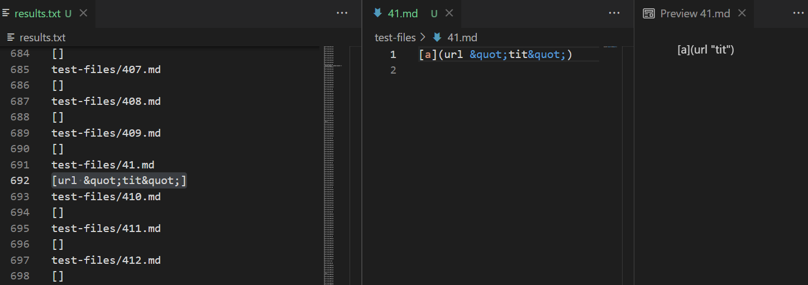
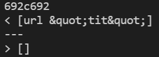
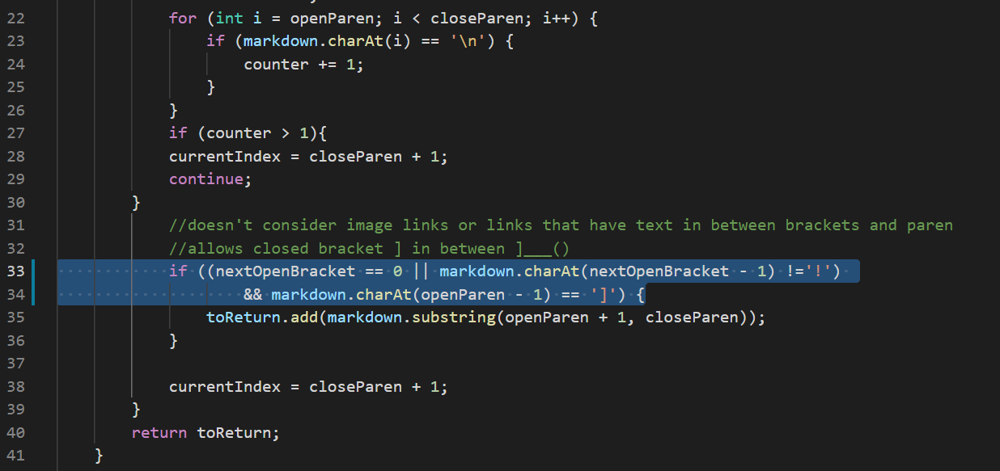

## Lab Report 5- Week 10
### Comparing Results 
 

I first added code to a file called `script.sh` that prints the file names and runs `java MarkdownParse` on each file. 

In my own markdown-parse repository and the given repository, I ran the tests in common-mark-spec and copied the results into a text file using the command `bash script.sh > results.txt`. I compared the results from the two text files by using the command `diff myMarkdown-parse/results.txt lab9-markdown-parse/results.txt`. 

The first line tells us the line number in `results.txt`. Then, the output from `results.txt` in my repo is followed by a line followed by the output from `results.txt` in the given repo. Because the script file printed the file names, I was able to find the corresponding files with the tests. 

**Test 1** 

Looking at line 270 in `results.txt`, we see that it tests `22.md`. 

Expected output: `[/bar*]`  
My output: `[/bar\* "ti\*tle"]`  
Given repo output: `[]`

Both the implementations in `myMarkdown-parse` and in `lab9-markdown-parse` are incorrect, as they gave us a different output than expected.  

The bug in the given repo's MarkdownParse is that the implementation does not account for spaces in links. Normally, spaces are not allowed in valid links. However, markup can contain links with a title text (text that pops up when you roll over the link), which is indicated by the link url, a space, and the title text in quotes. In this special case, the space is allowed. In the given implementation from lab 9, if there is a space in the link, it does not output a link. The code that should be fixed is in line 75 and is shown below. It should be changed to account for when there is a space followed by some text in quotes.

**Test 2**

Looking at line 692 in `results.txt`, we see that it tests `41.md`. 

Expected output: `[]`  
My output: `[url &quot;tit&quot;]`  
Given repo output: `[]`

We know the implementation in `myMarkdown-parse` is incorrect, as it gave us a different output, while the implementation in `lab9-markdown-parse` is correct, as it gave us the expected output.  

The bug in my MarkdownParse is that the implementation is that it does not account for spaces in the links. There cannot be spaces in the links inside the parentheses. Here the `&quot;` do not give us a title text as before because it indicates we want to use the actual quote symbol. So a space is not allowed inside the link. The code that should be fixed is the if statement shown below. It should check to make sure there is no space within the parentheses before adding a link.

